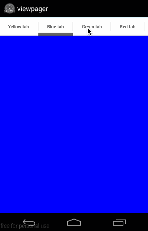

**NOTE**: The module this widget wraps currently doesn't work in Titanium 3.3 and up.

----------------

# Alloy Android ViewPager Widget
This is a widget for the [Alloy](http://projects.appcelerator.com/alloy/docs/Alloy-bootstrap/index.html) MVC framework of [Appcelerator](http://www.appcelerator.com)'s [Titanium](http://www.appcelerator.com/platform) platform.

It wraps the [Android ViewPager Module](http://gitt.io/component/com.navid.tabs) module by Navid Ghahramani, which exposes the native ViewPager found in apps like Google Play.

[](http://appcelerator.com/titanium/) [](http://appcelerator.com/alloy/)

## Example

[]

## Usage [](http://gitt.io/component/nl.fokkezb.drawer)
1. Install the [Android ViewPager Module](http://gitt.io/component/com.navid.tabs) module for Android via [gitTio](http://gitt.io):

    `gittio install com.navid.tabs`

2. Install [this widget](http://gitt.io/component/nl.fokkezb.viewpager) via [gitTio](http://gitt.io):

	`gittio install nl.fokkezb.viewpager`
	
3. In your `app/views/index.xml` use it like this:

	```
	<Alloy>	
	  <Window>
	  	<Widget id="pager" src="nl.fokkezb.viewpager">
	      <View backgroundColor="red" title="Red tab" />
	      <View backgroundColor="green" title="Green tab" />
	      <View backgroundColor="blue" title="Blue tab" />
	      <View backgroundColor="yellow" title="Yellow tab" />
	    </Widget>
	  </Window>
	</Alloy>
	```
	
4. In your `app/styles/index.tss` style it like this:

	```
	"#pager": {
		backgroundColor: 'white',
		alignment: 'ALIGNMENT_RIGHT',
		current: 2
	}
	```
	
	**NOTE:** You don't need to group the properties in a `tab` object like the module requires and the `alignment` constant can be set as a string.
	
5. In your `app/controlers/index.js` use it like this:

	```
	$.index.open();
	
	$.pager.add(Ti.UI.createView({
	  title: 'Dynamic tab',
	  backgroundColor: 'white'
	}));
	```
	
	**NOTE:** Any ViewPager property or method can be get, set or called via the widget, but you can also access the module and instance directly via `$.pager.module` and `$.pager.instance`.
	
## Events
The module uses constants like `module.PAGE_SCROLLED_EVENT_NAME` for the event names. The widget supports adding event listeners in the following ways:

**index.xml**

	<Widget src="nl.fokkezb.viewpager" onPAGE_SCROLLED_EVENT_NAME="myListener" />

**index.js**

	$.pager.on('PAGE_SCROLLED_EVENT_NAME', myListener);

Of course you can also refer to the actual constant with `$.pager.module.PAGE_SCROLLED_EVENT_NAME` or the string `pageScrolled` the constant stands for.

## License

<pre>
Copyright 2014 Fokke Zandbergen

Licensed under the Apache License, Version 2.0 (the "License");
you may not use this file except in compliance with the License.
You may obtain a copy of the License at

   http://www.apache.org/licenses/LICENSE-2.0

Unless required by applicable law or agreed to in writing, software
distributed under the License is distributed on an "AS IS" BASIS,
WITHOUT WARRANTIES OR CONDITIONS OF ANY KIND, either express or implied.
See the License for the specific language governing permissions and
limitations under the License.
</pre>
